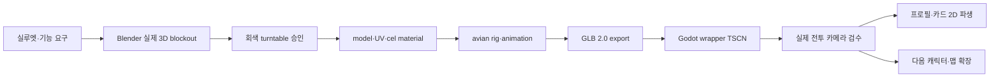

# Drumstack Battle 3D 에셋 버티컬 슬라이스 설계

> 상태: 사용자 방향 승인 · 구현 전 서브명세
> 기준일: 2026-08-11 · Europe/Berlin
> 시각 동반 문서: [`DRUMSTACK_3D_ASSET_VERTICAL_SLICE_SPEC.html`](../../drumstack/DRUMSTACK_3D_ASSET_VERTICAL_SLICE_SPEC.html)
> 상위 정본: [`DRUMSTACK_BATTLE_MASTER_SPEC.html`](../../drumstack/DRUMSTACK_BATTLE_MASTER_SPEC.html)
> House Duck 공통 정본: `shared/standards/house_duck_asset_art_standard.md`
> 공유 폴더가 Git으로 추적되기 전에는 이 문서가 프로젝트 실행용 fallback을 소유한다.

## 1. 목적과 범위

첫 경기 전체를 만들기 전에 다음 한 묶음을 실제 3D 품질 기준본으로 만든다.

```text
덕 대장 1명
+ AT식 11×9 전장 1구역
+ 전술 타일·점유·대상 표시 1세트
+ 전투 HUD·4행동 UI 1세트
+ 기본기·액티브·대표기·피격 VFX
```

이 슬라이스는 10영웅과 전체 맵을 선제작하는 단계가 아니다. 기준본이 실제 Godot 전투 카메라와 목표 기기에서 통과한 뒤에만 닭·비둘기와 두 번째 맵으로 확장한다.

### 포함

- `hero.duck_guard`의 실제 DCC 원본, GLB, cel material, 조류 rig와 필수 애니메이션.
- `arena.service_rooftop_01`의 authored 3D blockout과 기능 소품.
- 현재 유닛, 이동, 스킬 범위, 위험, 점유, 막힘, 대상과 목적지 ghost.
- NEXT queue, HP·상태, 예상 결과, 기본기·액티브·대표기·방어 UI.
- 실제 Godot 렌더에서 normal/Reduce Motion 비교.

### 제외

- 생성 이미지를 모델시트, 텍스처, 맵 또는 UI 원본으로 사용.
- 닭·비둘기 최종 모델, 나머지 7영웅, 두 번째 전장.
- 상점 전체, 스킨, 장비, 가챠, Supabase, 광고·결제 SDK.
- 생성 배경화, photo texture, 자동 2D→3D 변환, runtime cloth·feather physics.

## 2. 승인된 시각 결정

### DS-ART-001 · 3D master 우선

- 제품 정본은 `hero_duck_guard.glb`와 source DCC 파일이다.
- 별도 2D 캐릭터 원화는 제품 정본이 아니다.
- 프로필, 전신, 상점, 행동 큐와 말풍선 초상은 승인 GLB를 고정 render profile로 파생한다.
- 생성 이미지는 최종 자산과 승인 기준에서 제외한다.

### DS-ART-002 · House Duck 손맛

- 덕 대장의 첫 인상은 `묵직한 몸통 → 부리와 눈 → 오리 궁둥이와 꼬리 → 등 방패` 순서다.
- 정보 밀도는 `70% 조용한 큰 면 / 20% 얼굴·발·방패 / 10% 스카프·배지·일시 강조`다.
- 시각 비대칭은 볏, 눈 간격, 스카프 매듭, 꼬리깃, 포즈에만 의도적으로 둔다.
- 리그, 웨이트, 접지, pivot, contact marker와 타일 좌표는 정확해야 한다.

#### Project K 최신 cel3D 결과에서 가져올 품질 기준

사용자가 2026-08-11 제공한 Project K `cel3d-rebuild` 이미지는 선호 방향과 모델링 보드의 시각 하한이다. Project K의 runtime-ready/승인 GLB 증거로 간주하지 않고 제품 파일로 복사하지 않으며, 아래 원리만 Duck Guard의 실제 source→GLB→Godot 결과에 적용한다.

- 정면·측면·후면에서 같은 큰 질량과 비율이 유지되고, 한 시점에서만 그럴듯한 생성형 실루엣을 금지한다.
- 몸통·다리·방패를 3~5개의 읽히는 덩어리로 나누고, 작은 장식보다 관절과 기능 pivot을 먼저 보인다.
- base color와 한 단계 그림자 위주로 면을 정리한다. 모든 edge에 같은 선·광택·재질 noise를 넣지 않는다.
- walk, turn, attack는 결과 pose만 두지 않고 발·무게중심·방패·머리의 이동 arc를 contact sheet에 함께 표시한다.
- Duck Guard 납품 보드는 `front / 3-4 front / side / back / move arc / basic contact` 6칸을 같은 camera·scale·light로 렌더한다.
- Project K의 군용 올리브 팔레트, 탱크·굴착기·헬기 형상, 기계 관절 비율은 가져오지 않는다. 조류의 둥근 몸통, 물갈퀴, 부리, 오리 궁둥이와 셀 애니 표정을 유지한다.

### DS-MAP-001 · AT식 기능 중심 3D 전장

- 평상시 바닥 격자는 은은하게 유지하고 현재 행동을 선택할 때 필요한 타일만 강하게 표시한다.
- 작은 3D 전장, 고정 사선 카메라, 현재 유닛 발판, NEXT, HP·상태와 범위 preview를 우선한다.
- 환경은 배경화가 아니라 modular 3D geometry와 직접 만든 material로 구성한다.
- 참고 게임의 정보 순서는 사용할 수 있지만 맵, 건물, UI frame, font, icon과 exact camera shot은 복제하지 않는다.

## 3. 3D-first 제작 흐름



- Godot runtime 축은 `+Y up`, `-Z forward`, `+X right`, 1 Godot unit=1m로 고정한다.
- GLB에 camera와 light를 포함하지 않는다. 프로젝트 scene이 카메라·광원을 소유한다.
- imported GLB를 직접 편집하지 않고 wrapper TSCN에서 external material, AnimationTree, sockets와 VFX를 연결한다.
- 전투 규칙과 이동 결과는 BattleRules와 논리 타일이 소유한다. 애니메이션 callback과 mesh collider는 권위가 아니다.

### Blender 4.5 LTS → GLB 2.0 → Godot 4.7 납품 계약

| 단계 | 고정값 |
|---|---|
| DCC | Blender `4.5 LTS`, Meter/Unit Scale `1.0`, source는 `+Z up/-Y forward/+X right` |
| Collection | 최상위 `EXPORT`; 하위 `GEO_LOD0`, `GEO_LOD1`, 선택 `GEO_LOD2`, `RIG`, `SOCKETS`만 export |
| Character object | root object와 Armature는 `hero_duck_guard`; mesh는 `hero_duck_guard_lod0/1/2`; 임시 object는 `_work_` prefix로 `EXPORT` 밖에 둔다 |
| Environment object | root는 `arena_service_rooftop_01`; module은 `{group}_{function}_{2-digit}` 예: `blocker_high_hvac_01`; collision은 같은 basename에 `_col_move` 또는 `_col_los` suffix |
| Transform | character origin은 양발 접지 중앙, environment origin은 보드 중심; export object rotation `0,0,0`, scale `1,1,1`; Armature 음수 scale과 skin 이후 rest pose/apply transform 금지 |
| Export | 선택 collection만 Binary `.glb`; modifiers·UV·tangent·skin·morph 포함, camera/light 제외, Draco 제외, animation 30fps sample, NLA strip 이름을 exact clip ID로 export |
| Runtime 검사 | imported root에서 `+Y up/-Z forward/+X right`, 높이 1.42m 후보, root scale `1,1,1`; 불일치 시 wrapper 보정이 아니라 export 실패 |
| Godot import | Godot 4.7 scene import, animation/morph/skin 유지, embedded material은 wrapper에서 external profile로 remap; loop와 event track은 아래 계약으로 검증 |

캐릭터와 환경은 각각 `resources/drumstack/contracts/glb_character_import_v1.json`, `glb_environment_import_v1.json`의 값으로 import 검사를 자동화한다. Godot가 생성한 `.godot/imported/**`와 `.import` 캐시는 source가 아니며 manifest에 넣지 않는다.

## 4. 덕 대장 3D 규격

| 항목 | 승인안 |
|---|---|
| 정체성 | 골목을 지키는 느긋하지만 믿음직한 오리 경비대장 |
| 체형 | 약 3.4등신, 넓은 가슴, 물방울형 큰 몸통, 짧고 굵은 다리 |
| 시그니처 | 자연스러운 둥근 오리 궁둥이, 작은 꼬리깃, 넓은 물갈퀴 |
| 복장 | 비대칭 청록 스카프, 작은 노랑 배지, 넓은 방패 strap만 |
| 장비 | 궁둥이 바로 위에 접힌 둥근 청록 등 방패 1개 |
| 금지 | 재킷·바지·포켓·전술 조끼·사람 손·인간 근육·네모 몸통 |
| 크기 후보 | 높이 1.42m, 정면 최대 폭 0.82m, 실제 전장 카메라에서 조정 |

### 모델·재질 후보 예산

| 항목 | 상한 후보 |
|---|---:|
| LOD0 | 18k tris |
| LOD1 | 7k tris |
| LOD2 | 2k tris |
| deform bones | 28~36 |
| vertex bone influence | 최대 4 |
| materials | 최대 2 |
| character atlas | 1024 1세트 + 필요 시 eyes 256 |
| 전투 기본 | 6명 LOD1 |
| 근접 행동 | 공격자·대상만 LOD0 |

예산은 실제 Android·iPhone 측정 전 `PROPOSED`다. silhouette와 얼굴이 깨지지 않는 가장 낮은 수치를 사용한다.

### 셀 material

- 기본색, 그림자, 제한된 강조의 2단을 기본으로 한다.
- 대표기 근접에서만 3단 또는 선택적 outline을 허용한다.
- 깃털 한 올, 실사 roughness noise, 전면 rim light, 균일 specular와 생성 texture를 사용하지 않는다.
- 깃털 큰 면은 쉬게 두고 눈·부리·발·방패 접점에만 edge와 value contrast를 집중한다.

`assets/drumstack/materials/shaders/cel_character_mobile.gdshader`와 `assets/drumstack/materials/character_cel_mobile.tres`가 캐릭터 재질 정본이다. texture는 `assets/drumstack/characters/hero_duck_guard/textures/hero_duck_guard_albedo.png`와 `hero_duck_guard_mask.png`다. albedo는 RGBA8 sRGB, mask는 linear로 R=shadow threshold, G=제한 specular, B=emission, A=선택 outline group을 저장한다. 기본 normal/ORM은 만들지 않으며 두 texture 모두 1024, mipmap on, mobile VRAM compression, anisotropic 4x 이하로 import한다. 환경은 같은 channel 의미의 `assets/drumstack/materials/shaders/cel_environment_mobile.gdshader`를 쓰며 `assets/drumstack/environments/arena_service_rooftop_01/textures/arena_service_rooftop_01_atlas_0_albedo.png`와 `_mask.png`, 필요 시 `atlas_1_albedo.png`와 `_mask.png` 2048 세트를 사용한다.

기준 render profile은 Godot Mobile renderer, 1600×720 logical viewport와 2400×1080 QA capture, 2x MSAA, shadow atlas 2048, glow·motion blur·SSAO·dynamic GI off다. `resources/drumstack/profiles/world_mobile_mid.tres`가 WorldEnvironment/DirectionalLight 값, `resources/drumstack/profiles/camera_battle_20x9.tres`가 orthographic `yaw 45°/pitch -52°/roll 0°/size 13.5`를 소유한다. wrapper나 스킬 scene이 이 값을 복제하지 않는다.

## 5. 조류 rig와 표정

```text
root
└─ body_root
   ├─ spine_01 → chest → neck_01 → neck_02 → head
   │                                      ├─ bill_lower
   │                                      ├─ crest_01 → crest_02
   │                                      ├─ eye_l
   │                                      └─ eye_r
   ├─ tail_root → tail_fan_l / tail_fan_r
   ├─ wing_l_shoulder → wing_l_upper → wing_l_forearm → wing_l_wrist → wing_l_primary
   ├─ wing_r_shoulder → wing_r_upper → wing_r_forearm → wing_r_wrist → wing_r_primary
   ├─ leg_l_thigh → leg_l_shin → leg_l_ankle → foot_l → toe_l
   └─ leg_r_thigh → leg_r_shin → leg_r_ankle → foot_r → toe_r
```

필수 socket은 아래 exact 규칙의 `socket_*` 10개다.

마스터 명세의 `hips` 용어는 조류형 `body_root`로 통일한다. `shield_root` 아래에는 좌·중·우 3개 rigid panel과 각각의 pivot을 두고, 등 socket에 붙인 채 접힘→전개 transform만 bake한다.

### Skeleton·face·socket exact 규칙

- 이 subsection의 exact ID가 에셋 제작 실행 정본이다. 상위 HTML의 `beak`, `wing.LR`, `hips` 표기는 설명용 shorthand이며 별도 bone 이름으로 만들지 않는다.
- bone과 socket의 좌우 suffix는 `_l`, `_r`만 사용한다. `.L/.R`, `LR`, `beak`, `hips`는 금지하고 `bill_lower`, `body_root`로 통일한다.
- rest pose는 정면 `-Z`, 양발 전체 접지, 날개는 몸에서 25° 이내, 꼬리·방패 닫힘이다. 중심 bone의 local `+Y`는 자식 방향, `+Z`는 전방을 향하고 좌우 bone은 음수 scale 없이 같은 roll 규칙으로 mirror한다.
- 얼굴 v1은 bone 방식만 사용한다. `lid_upper_l/r`, `lid_lower_l/r`, `eye_l/r`, `bill_lower`, `crest_01/02`를 사용하고 blendshape는 만들지 않는다.
- socket은 non-deform `Node3D`로 wrapper에 생성하며 exact 이름은 `socket_back`, `socket_shield`, `socket_bill_fx`, `socket_chest_fx`, `socket_wing_l_fx`, `socket_wing_r_fx`, `socket_foot_l_fx`, `socket_foot_r_fx`, `socket_ground_fx`, `socket_target_center`다. 모든 socket scale은 1이며 `socket_ground_fx`는 양발 중앙의 Y=0에 둔다.
- `shield_root`, `shield_panel_l/c/r`은 rigid accessory bone이다. panel mesh는 deform하지 않고 각 panel pivot의 local rotation만 animation한다.

### 머리·시선 안정화 계약

- 실제 조류처럼 몸은 움직여도 머리는 잠깐 공간에 남고, 짧게 다음 고정점으로 따라잡는 `hold → catch-up`을 사용한다. [비둘기 머리 안정화 연구](https://pmc.ncbi.nlm.nih.gov/articles/PMC5633612/)와 [메추라기 보행 연구](https://pmc.ncbi.nlm.nih.gov/articles/PMC3987125/)를 동작 원리 근거로 삼되 종별 진폭은 실제 turntable에서 조정한다.
- 새 bone, runtime IK와 procedural controller를 추가하지 않는다. 기존 `neck_01 → neck_02 → head` key animation으로 몸통 움직임을 상쇄한다.
- `idle_combat`, `move_*`, `turn_*`에서 적용한다. steady move-loop의 head pitch·roll은 rest 대비 ±5° 이내, 화면상 눈 높이 흔들림은 머리 높이의 10% 이내를 A4/DS-TC-RIG-001 후보 합격선으로 둔다.
- 몸통 bob·궁둥이 sway·꼬리와 방패 후행은 그대로 유지한다. 이동 중 머리 catch-up은 0.06~0.10초, 회전은 시선과 머리가 몸보다 2~4 render frame 먼저 새 방향을 본다.
- 부리 공격 contact, 일반 피격의 첫 2 render frame, 강피격과 KO에서는 안정화를 의도적으로 줄이거나 해제한다. 방패 스킬은 gaze lock을 유지하고, 일반 피격은 0.18~0.24초 안에 재고정한다.
- 이 규칙은 silhouette 품질만 소유한다. hitbox, contact 위치, root 경로, 결과 타일과 BattleRules 판정을 바꾸지 않는다. Reduce Motion에서도 기본 조류 움직임으로 유지한다.
- 덕 대장은 은은하게, 닭·비둘기는 더 또렷하게, 거위는 긴 목 하단의 굽힘으로 흡수한다. 모든 조류에 같은 머리 bob 진폭을 복사하지 않는다.

표정은 `neutral`, `focus`, `assertive`, `hit`, `uneasy`, `victory` 6개다. 얼굴만 바꾸지 않고 머리, 목, 부리, 날개와 체중 중심을 함께 바꾼다. 눈꺼풀, 시선, 부리 열림, 머리 기울기와 볏을 조절하되 사람 얼굴의 입술·볼·손가락을 추가하지 않는다.

## 6. 애니메이션 패키지

| 클립 | 목표 길이 | 필수 읽기 |
|---|---:|---|
| `idle_combat` | 2.40s loop | 느린 호흡, 좌우 체중 이동, 꼬리깃 1회, 머리 안정·불규칙 시선 |
| `move_start`, `move_loop`, `move_stop` | 0.10/0.36/0.10s | 뒤뚱거림, 궁둥이·꼬리 반동, 물갈퀴 접지, 머리 hold→catch-up |
| `turn_45`, `turn_90`, `turn_180` | 0.10/0.16/0.24s | 시선·머리 2~4 frame 선행 후 넓은 발과 몸통이 따라 회전 |
| `basic_beak_shield` | 0.88s | 준비 → 부리 contact → self shield → 복귀 |
| `active_quack_challenge` | 1.05s | 흡기 → 부채꼴 음파 → 상태 표시 → 복귀 |
| `signature_duck_formation` | 2.25s | 등 방패 전개 → 지면 contact → 아군 보호 → 복귀 |
| `guard_enter`, `guard_loop`, `guard_hit`, `guard_exit` | 0.20/1.20/0.22/0.16s | 방패 앞세움과 압축 반동 |
| `hit_light`, `hit_heavy`, `hit_push` | 0.40/0.64/0.72s | 방향성 충격에서 머리 lock 해제→재고정, 궁둥이·꼬리 후행, 결과 타일 접지 |
| `ko` | 1.20s | 방패에 기대 앉듯 다운, 마지막 pose hold |
| `victory` | 1.80s | 날개 경례, 짧은 꽥, 방패를 가볍게 두드림 |

- 이동 clip은 in-place이며 controller가 논리 경로로 root를 이동한다.
- key pose는 순간적으로 과장할 수 있지만 contact 위치와 결과 타일을 바꾸지 않는다.
- animation marker는 VFX·SFX·카메라용이다. 피해·보호막·상태 계산에 사용하지 않는다.
- 일반 행동은 카메라 복귀까지 1.2초 이하, 대표기는 2.5초 이하로 끝낸다.

모든 clip은 30fps이며 이동은 root motion 없는 in-place다. loop는 `idle_combat`, `move_loop`, `guard_loop`만 true다. exact marker ID는 `mk_prepare`, `mk_vfx_floor`, `mk_sfx_swing`, `mk_contact`, `mk_vfx_contact`, `mk_sfx_contact`, `mk_result`, `mk_camera_peak`, `mk_recover`다. Blender pose marker와 `resources/drumstack/characters/hero_duck_guard_animation_events.json`의 frame이 일치해야 하며 wrapper는 이 JSON으로 AnimationPlayer event track을 만든다. `mk_contact`는 연출 신호일 뿐 BattleRules 판정 시각을 바꾸지 않는다.

## 7. AT식 전장과 카메라

전장 ID는 `arena.service_rooftop_01`, 정체성은 **네온 골목 상부의 옥상 설비장**으로 잠근다. 아래 골목의 간판 빛과 배관·옥상 출입구가 보이되 플레이 보드는 옥상의 평평한 11×9 전술면이며 도시 깊이는 보드 바깥 3D 배경으로만 표현한다.

### 1.25m modular grid 계약

- tile은 1.25m 정사각형이다. 보드 중심이 world `(0,0,0)`이며 tile `(x,y)` 중심은 `((x-5)*1.25, 0, (y-4)*1.25)`다. `(0,0)`은 화면상 북서, `x`는 동쪽, `y`는 남쪽으로 증가한다.
- 1칸 module과 소품 pivot은 접지면 중앙, 다칸 module pivot은 가장 작은 `(x,y)` tile 중앙이다. mesh는 grid에서 0.01m 이상 임의 offset하지 않는다.
- render mesh collision을 사용하지 않는다. 이동 차단은 `_col_move` 단순 box, 시야 차단은 `_col_los` 단순 box로 분리한다. 높은 설비벽만 LOS 높이 1.8m로 차단하고 낮은 상자는 LOS를 통과시킨다.
- 전술면+기능 소품은 45k tris/8 materials/60 draw calls 이하, 보드 밖 배경은 80k tris/4 materials 이하를 후보 상한으로 둔다. static prop은 atlas와 MultiMesh를 우선하고 tile overlay를 이 예산에 합산하지 않는다.
- source collection은 `FLOOR`, `BLOCKER_HIGH`, `BLOCKER_LOW`, `PROP_INTERACTIVE`, `BACKDROP`, `COLLISION_MOVE`, `COLLISION_LOS`다. 기능 소품 object ID는 `prop_barrel_01`, `prop_snack_vendor_01`, `prop_drain_hatch_01` 형식을 쓴다.

### 기능 소품

| 소품 | 수 | 규칙 |
|---|---:|---|
| 높은 설비벽 | 8칸 이하 | 이동·시야 차단 |
| 낮은 택배 상자 | 4칸 | 이동 차단, 투사체 통과 후보 |
| 폭발 배럴 | 2개 | 파괴·폭발 범위 preview |
| 간식 자판기 | 2개 | 회복 효과를 선택 전에 공개 |
| 배수 해치 | 2개 | 도시 소동 위치, 숨은 함정 금지 |

- 중앙 접근로를 최소 3개 둔다.
- 시작 배치는 180도 회전 대칭으로 한다.
- 기능이 없는 간판·창문·배선·쓰레기를 반복해 화면을 채우지 않는다.
- 배경 대비와 채도는 전술면보다 낮다.

### Camera3D

- 고정 yaw/pitch/roll을 모든 행동에서 공유한다.
- 기준 후보는 orthographic, yaw `45°`, pitch `-52°`, roll `0°`, size `13.5`다. 실제 보드와 바깥 0.75타일이 모두 보이도록 A0에서 size만 보정해 camera profile에 저장한다.
- 허용은 보드 평면 pan과 5~15% zoom뿐이다.
- orbit, roll, 월선, 반대편 시점, 스킬마다 다른 각도를 금지한다.
- 공격자와 대상이 동시에 안전영역에 들어오지 않으면 zoom-in을 포기한다.
- Reduce Motion에서는 camera transform 변화, shake, tracking과 cut-in을 0으로 한다.

## 8. 타일·점유·대상 표시

격자는 평상시에 은은하게 유지한다. 행동 단계에서 필요한 subset만 강하게 표시한다.

| 상태 | 색·투명도 후보 | 색 외 구분 |
|---|---|---|
| 현재 유닛 | cyan solid pedestal | 위쪽 notch와 pulsating 1회 |
| 이동 가능 | cyan 34% | 점선 outline·방향 arrow |
| 스킬 범위 | amber 32% | 부리형 corner cut·footprint |
| 적 위험 | coral 28% | 이중 outline·warning slash |
| 아군 점유 | teal ring | feather notch |
| 적 점유 | coral ring | triangular beak notch |
| 막힘 | charcoal 18% | crosshatch·X |
| 목적지 ghost | actor 35% | destination ring |
| 대상 | 팀색 outline | 짧은 수직 marker |
| 경로·LOS | 단일 floor line | 시작·끝 arrow |

- transparent tile mesh는 바닥 material을 완전히 덮지 않는다.
- 색각 없이 outline과 문양만으로 모든 상태를 구분해야 한다.
- preview와 resolve가 같은 범위·대상·수치를 보여야 한다.

tile 표시 정본은 `scenes/drumstack/battle/tiles/tile_overlay.tscn`과 `assets/drumstack/vfx/tiles/tile_overlay.gdshader`다. plane은 1.20m, pivot 중앙, 바닥 위 Y=0.012m, depth test on, shadow off, cull disabled다. render priority는 점유 2, 범위 3, 대상 4로 고정하고 색·opacity·outline·hatch는 shader parameter만 바꾼다. idle 보드 전체 overlay는 1 draw call, 행동 subset은 MultiMesh 4 draw calls 이하를 목표로 한다.

## 9. 전투 HUD

2400×1080 가로 화면을 기준으로 한다.

```text
상단: 목표 | 행동 7/24·점수·시간 | NEXT 6명 | 메뉴
중앙: 11×9 전장·유닛 HP·상태·타일 preview
하단: 현재 영웅 | 예상 피해·보호막 | 기본기·액티브·대표기·방어
```

- AT의 `현재 유닛 → 합법 이동 → 범위 → 대상 → 결과 → NEXT` 정보 순서를 사용한다.
- ZZZ에서 느껴지는 큰 흑백 면과 비대칭 그래픽 리듬은 참고할 수 있다.
- exact UI frame, font, icon, logo, sticker, coordinate와 animation을 복제하지 않는다.
- 상시 HUD는 `70/20/10` 강약을 유지한다. 모든 panel과 outline을 동시에 밝히지 않는다.
- UI text는 이미지에 굽지 않고 localization과 실제 font로 렌더한다.
- 행동 버튼 4개의 위치는 상태와 cooldown에 따라 움직이지 않는다.
- 행동 제한시간은 상단 우측에 고정하고, `CONFIRM`에서는 예상 결과 옆에 `실행/취소`를 세로로 쌓는다. 두 버튼은 각 96px 이상 touch height를 확보한다.
- 동반 HTML의 축소 CSS 도형 수치는 배치 설명용이며 구현 치수가 아니다. 실행/취소의 96 logical px와 본 문서의 resource 계약이 항상 우선한다.

UI source는 `art_source/drumstack/ui/battle_house_duck_v1/`의 `frame_battle.svg`, `icon_action_basic.svg`, `icon_action_active.svg`, `icon_action_signature.svg`, `icon_action_guard.svg`, `icon_tile_move.svg`, `icon_tile_attack.svg`, `icon_tile_danger.svg`와 `panel_battle_32.9.png`, `panel_speech_24.9.png`, `button_action_24.9.png`다. runtime은 같은 basename으로 `assets/drumstack/ui/battle_house_duck_v1/`에 두고 `themes/drumstack/battle_house_duck_v1.tres`가 font size, color, margin, focus, disabled 상태를 소유한다. SVG/9-patch에 text를 굽지 않는다.

말풍선 prefab은 `scenes/drumstack/ui/battle/bird_speech_bubble.tscn`이다. 입력은 `hero_id`, `expression_id`, `localization_key`, `anchor_socket`, `priority`이며 기본 anchor는 `socket_target_center`, 초상은 derivative manifest의 128px profile을 쓴다. 기본은 발화자 반대쪽 위, 겹치면 좌→우→위 중앙 순으로 이동하고 어느 위치도 HP·범위·예상 결과·실행 버튼을 피하지 못하면 초상 없는 상단 toast로 fallback한다.

## 10. VFX storyboard

공통 layer는 `floor telegraph → character action → contact → result UI`다.

### 부리방패 · 0.88s

```text
0.00 focus
0.18 몸 중심 하강
0.40 부리 contact, 2 render frame hold
0.46 덕 대장 청록 shield +50
0.88 기본 카메라·pose 복귀
```

### 꽥 도전 · 1.05s

```text
0.00 흡기
0.18 2칸 부채꼴 telegraph
0.32 굽은 음파 3개
0.44 대상 contact
0.52 오리 아이콘·타 대상 피해 -25%
1.05 기본 전장 복귀
```

### 오리 방진 · 2.25s

```text
0.00 최대 15% zoom
0.30 등 방패 잠금 해제
0.60 깃털형 panel 3장 전개
0.88 지면 contact
1.05 아군 shield +150·밀침 면역
1.20 결과 hold
2.25 기본 전장·HUD 복귀
```

- 일시 VFX는 고정 자산보다 강하고 정교할 수 있다.
- HP, 얼굴과 타일을 0.25초 이상 가리지 않는다.
- full-screen blur, motion blur, dynamic light, 백색 과노출과 긴 camera rotation을 사용하지 않는다.

VFX scene은 `scenes/drumstack/vfx/hero_duck_guard/vfx_basic_beak_shield.tscn`, `vfx_active_quack_challenge.tscn`, `vfx_signature_duck_formation.tscn`, `vfx_hit.tscn`이다. 바닥 telegraph는 tile overlay shader, contact/result는 `GPUParticles3D`와 최소 mesh를 사용한다. 일반기 particle 160/texture 512/material 3/draw call 12 이하, 대표기 420/texture 1024/material 5/peak draw call 35 이하이며 transparent overdraw가 화면의 35%를 0.25초 넘게 덮으면 실패한다. spawn은 위 marker ID와 socket exact 이름만 사용한다.

## 11. 파일·manifest

```text
art_source/drumstack/characters/hero_duck_guard/hero_duck_guard.blend
art_source/drumstack/environments/arena_service_rooftop_01/arena_service_rooftop_01.blend
art_source/drumstack/ui/battle_house_duck_v1/
audio_source/drumstack/hero_duck_guard/
assets/drumstack/characters/hero_duck_guard/hero_duck_guard.glb
assets/drumstack/environments/arena_service_rooftop_01/arena_service_rooftop_01.glb
assets/drumstack/ui/battle_house_duck_v1/
assets/drumstack/audio/hero_duck_guard/
scenes/drumstack/battle/actors/hero_duck_guard.tscn
scenes/drumstack/battle/arenas/arena_service_rooftop_01.tscn
resources/drumstack/asset_manifest.schema.json
resources/drumstack/asset_manifest.json
```

파일은 `snake_case`, 논리 ID는 `hero.duck_guard`와 `arena.service_rooftop_01`을 사용한다. `final`, `new`, 임시 버전 suffix를 런타임 경로에 넣지 않고 Git commit과 manifest hash로 버전을 추적한다.

manifest `manifest_version=1` 항목은 `asset_id`, `asset_type`, `art_family`, `source{path,sha256,creator,tool,tool_version,origin,license}`, `runtime[{path,sha256}]`, `rig_profile`, `material_profile`, `render_profile`, `dependencies[]`, `animation_markers[]`, `derivative_of`, `derivatives[{profile,path,sha256}]`, `approved_gates[]`, `status`, `git_commit`을 필수로 가진다. 직접 제작은 `origin=authored_house_duck`, `license=house_duck_proprietary`로 기록한다. 외부 reference는 제품 asset entry가 아니며 manifest와 같은 폴더의 `reference_log.json`에 URL·권리자·열람 목적·`reference_only=true`만 남긴다. release manifest에 `candidate`, 누락/hash 불일치/임시 fallback/미상 license가 있으면 schema validation 실패다.

### 2D derivative·말풍선 초상 profile

`resources/drumstack/profiles/derivative_hero_v1.json`은 승인 GLB와 `resources/drumstack/profiles/world_portrait_v1.tres`만 입력으로 받는다. 3/4 front yaw 25°/pitch -6° orthographic, key/fill/rim 65/25/10, transparent RGBA8 sRGB PNG, premultiply off, UI/text 없음으로 고정한다. 출력은 `hero_duck_guard_full_{expression}_400x800.png`, `hero_duck_guard_profile_{expression}_256.png`, `hero_duck_guard_profile_{expression}_128.png`, `hero_duck_guard_queue_neutral_96.png`, `hero_duck_guard_shop_neutral_900x1200.png`이며 얼굴 중심과 발밑 safe crop 좌표도 profile에 기록한다. Gate D에서는 full/profile/queue만, shop은 Gate E에서 생성한다.

### Audio hook profile

source는 48kHz/24-bit mono WAV, runtime은 48kHz mono Ogg이며 bus는 `SFX/UI`, `SFX/Combat`, `Voice`만 사용한다. exact event ID는 `sfx.ui.turn.mine`, `sfx.ui.turn.enemy`, `sfx.ui.tile.valid`, `sfx.ui.tile.invalid`, `sfx.hero.duck_guard.basic.swing`, `sfx.hero.duck_guard.basic.contact`, `sfx.hero.duck_guard.active.cast`, `sfx.hero.duck_guard.signature.deploy`, `sfx.hero.duck_guard.hit`, `voice.hero.duck_guard.select`, `voice.hero.duck_guard.attack`, `voice.hero.duck_guard.hit`, `voice.hero.duck_guard.ko`, `voice.hero.duck_guard.victory`다. 파일명은 event ID의 점을 underscore로 바꿔 source `.wav`, runtime `.ogg`를 붙인다. 예: `sfx_hero_duck_guard_basic_contact.wav` → `sfx_hero_duck_guard_basic_contact.ogg`. `mk_sfx_swing`과 `mk_sfx_contact`만 animation에 직접 연결하며 나머지는 event ledger가 `resources/drumstack/audio/audio_event_map.json`을 통해 재생한다. 동일 event polyphony는 UI 2, Combat 4, Voice 1이고 contact가 swing/voice보다 우선한다.

## 12. 시각·기기 승인 게이트

| Gate | 통과 조건 | 미통과 시 |
|---|---|---|
| A0 · Blockout | 실제 3D turntable에서 오리·탱커·궁둥이·방패 판독 | model 제작 금지 |
| A1 · Source | GLB, rig, material, 필수 clips, manifest 누락 0 | Godot 연결 금지 |
| A2 · Import | Godot 4.7 import, skin·material·animation·socket 누락 0 | runtime QA 금지 |
| A3 · Map/UI | AT식 선택→이동→범위→대상→결과를 3초 안에 판독 | VFX polish 금지 |
| A4 · Runtime | 이동·3스킬·피격·KO normal/reduced P0/P1 0 | 대량 제작 금지 |
| A5 · Human | 5/5가 오리·탱커·6표정·타일 상태를 이름 없이 판독 | silhouette/UI 수정 |
| A6 · Device | Android와 iPhone 각각 safe area·fps·memory·thermal 통과 | 제품 완료 주장 금지 |
| A7 · Owner | 실제 Godot 화면과 turntable 승인 | 닭·비둘기 제작 금지 |

캡처는 최종 코드에서 2400×1080, 동일 seed·camera·locale로 만든다. 신규 자산은 `비포 캡처 없음: 신규 자산`을 기록하고 blockout→final 비교를 남긴다. macOS 캡처는 Android/iPhone 성능과 입력 증거가 아니다.

## 13. 자체 검토

- Placeholder와 TBD: 없음.
- 생성 이미지 의존: 없음. 실제 DCC·GLB·Godot 렌더만 승인 근거다.
- 2D/3D 정본 충돌: 없음. GLB가 master이고 2D는 파생이다.
- AT/ZZZ 참고 경계: 정보 순서와 고수준 그래픽 원리만 사용하고 exact asset 복제를 금지했다.
- 범위: 덕 대장 1명, 전장 1개, UI/VFX 1세트로 제한했다.
- 미검증: 실제 모델·리그·Godot 화면·Android/iPhone·사람 판독은 아직 생성되지 않았다.
