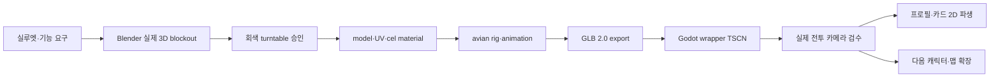

# Drumstack Battle 3D 에셋 버티컬 슬라이스 설계

> 상태: 사용자 방향 승인 · 구현 전 서브명세
> 기준일: 2026-08-11 · Europe/Berlin
> 시각 동반 문서: [`DRUMSTACK_3D_ASSET_VERTICAL_SLICE_SPEC.html`](../../drumstack/DRUMSTACK_3D_ASSET_VERTICAL_SLICE_SPEC.html)
> 상위 정본: [`DRUMSTACK_BATTLE_MASTER_SPEC.html`](../../drumstack/DRUMSTACK_BATTLE_MASTER_SPEC.html)
> House Duck 공통 정본: `shared/standards/house_duck_asset_art_standard.md`
> 공유 폴더가 Git으로 추적되기 전에는 이 문서가 프로젝트 실행용 fallback을 소유한다.

## 1. 목적과 범위

첫 경기 전체를 만들기 전에 다음 한 묶음을 실제 3D 품질 기준본으로 만든다.

```text
덕 대장 1명
+ AT식 11×9 전장 1구역
+ 전술 타일·점유·대상 표시 1세트
+ 전투 HUD·4행동 UI 1세트
+ 기본기·액티브·대표기·피격 VFX
```

이 슬라이스는 10영웅과 전체 맵을 선제작하는 단계가 아니다. 기준본이 실제 Godot 전투 카메라와 목표 기기에서 통과한 뒤에만 닭·비둘기와 두 번째 맵으로 확장한다.

### 포함

- `hero.duck_guard`의 실제 DCC 원본, GLB, cel material, 조류 rig와 필수 애니메이션.
- `arena.service_rooftop_01`의 authored 3D blockout과 기능 소품.
- 현재 유닛, 이동, 스킬 범위, 위험, 점유, 막힘, 대상과 목적지 ghost.
- NEXT queue, HP·상태, 예상 결과, 기본기·액티브·대표기·방어 UI.
- 실제 Godot 렌더에서 normal/Reduce Motion 비교.

### 제외

- 생성 이미지를 모델시트, 텍스처, 맵 또는 UI 원본으로 사용.
- 닭·비둘기 최종 모델, 나머지 7영웅, 두 번째 전장.
- 상점 전체, 스킨, 장비, 가챠, Supabase, 광고·결제 SDK.
- 생성 배경화, photo texture, 자동 2D→3D 변환, runtime cloth·feather physics.

## 2. 승인된 시각 결정

### DS-ART-001 · 3D master 우선

- 제품 정본은 `hero_duck_guard.glb`와 source DCC 파일이다.
- 별도 2D 캐릭터 원화는 제품 정본이 아니다.
- 프로필, 전신, 상점, 행동 큐와 말풍선 초상은 승인 GLB를 고정 render profile로 파생한다.
- 생성 이미지는 최종 자산과 승인 기준에서 제외한다.

### DS-ART-002 · House Duck 손맛

- 덕 대장의 첫 인상은 `묵직한 몸통 → 부리와 눈 → 오리 궁둥이와 꼬리 → 등 방패` 순서다.
- 정보 밀도는 `70% 조용한 큰 면 / 20% 얼굴·발·방패 / 10% 스카프·배지·일시 강조`다.
- 시각 비대칭은 볏, 눈 간격, 스카프 매듭, 꼬리깃, 포즈에만 의도적으로 둔다.
- 리그, 웨이트, 접지, pivot, contact marker와 타일 좌표는 정확해야 한다.

### DS-MAP-001 · AT식 기능 중심 3D 전장

- 평상시 바닥 격자는 은은하게 유지하고 현재 행동을 선택할 때 필요한 타일만 강하게 표시한다.
- 작은 3D 전장, 고정 사선 카메라, 현재 유닛 발판, NEXT, HP·상태와 범위 preview를 우선한다.
- 환경은 배경화가 아니라 modular 3D geometry와 직접 만든 material로 구성한다.
- 참고 게임의 정보 순서는 사용할 수 있지만 맵, 건물, UI frame, font, icon과 exact camera shot은 복제하지 않는다.

## 3. 3D-first 제작 흐름



- 축은 `+Y up`, `-Z forward`, `+X right`, 1 Godot unit=1m로 고정한다.
- GLB에 camera와 light를 포함하지 않는다. 프로젝트 scene이 카메라·광원을 소유한다.
- imported GLB를 직접 편집하지 않고 wrapper TSCN에서 external material, AnimationTree, sockets와 VFX를 연결한다.
- 전투 규칙과 이동 결과는 BattleRules와 논리 타일이 소유한다. 애니메이션 callback과 mesh collider는 권위가 아니다.

## 4. 덕 대장 3D 규격

| 항목 | 승인안 |
|---|---|
| 정체성 | 골목을 지키는 느긋하지만 믿음직한 오리 경비대장 |
| 체형 | 약 3.4등신, 넓은 가슴, 물방울형 큰 몸통, 짧고 굵은 다리 |
| 시그니처 | 자연스러운 둥근 오리 궁둥이, 작은 꼬리깃, 넓은 물갈퀴 |
| 복장 | 비대칭 청록 스카프, 작은 노랑 배지, 넓은 방패 strap만 |
| 장비 | 궁둥이 바로 위에 접힌 둥근 청록 등 방패 1개 |
| 금지 | 재킷·바지·포켓·전술 조끼·사람 손·인간 근육·네모 몸통 |
| 크기 후보 | 높이 1.42m, 정면 최대 폭 0.82m, 실제 전장 카메라에서 조정 |

### 모델·재질 후보 예산

| 항목 | 상한 후보 |
|---|---:|
| LOD0 | 18k tris |
| LOD1 | 7k tris |
| LOD2 | 2k tris |
| deform bones | 28~36 |
| vertex bone influence | 최대 4 |
| materials | 최대 2 |
| character atlas | 1024 1세트 + 필요 시 eyes 256 |
| 전투 기본 | 6명 LOD1 |
| 근접 행동 | 공격자·대상만 LOD0 |

예산은 실제 Android·iPhone 측정 전 `PROPOSED`다. silhouette와 얼굴이 깨지지 않는 가장 낮은 수치를 사용한다.

### 셀 material

- 기본색, 그림자, 제한된 강조의 2단을 기본으로 한다.
- 대표기 근접에서만 3단 또는 선택적 outline을 허용한다.
- 깃털 한 올, 실사 roughness noise, 전면 rim light, 균일 specular와 생성 texture를 사용하지 않는다.
- 깃털 큰 면은 쉬게 두고 눈·부리·발·방패 접점에만 edge와 value contrast를 집중한다.

## 5. 조류 rig와 표정

```text
root
└─ body_root
   ├─ spine_01 → chest → neck_01 → neck_02 → head
   │                                      ├─ bill_lower
   │                                      ├─ crest_01 → crest_02
   │                                      ├─ eye_l
   │                                      └─ eye_r
   ├─ tail_root → tail_fan_l / tail_fan_r
   ├─ wing_l_shoulder → upper → forearm → wrist → primary
   ├─ wing_r_shoulder → upper → forearm → wrist → primary
   ├─ leg_l_thigh → shin → ankle → foot → toe
   └─ leg_r_thigh → shin → ankle → foot → toe
```

필수 socket은 `back`, `shield`, `bill_fx`, `chest_fx`, `wing_l/r_fx`, `foot_l/r_fx`, `ground_fx`, `target_center`다.

마스터 명세의 `hips` 용어는 조류형 `body_root`로 통일한다. `shield_root` 아래에는 좌·중·우 3개 rigid panel과 각각의 pivot을 두고, 등 socket에 붙인 채 접힘→전개 transform만 bake한다.

표정은 `neutral`, `focus`, `assertive`, `hit`, `uneasy`, `victory` 6개다. 얼굴만 바꾸지 않고 머리, 목, 부리, 날개와 체중 중심을 함께 바꾼다. 눈꺼풀, 시선, 부리 열림, 머리 기울기와 볏을 조절하되 사람 얼굴의 입술·볼·손가락을 추가하지 않는다.

## 6. 애니메이션 패키지

| 클립 | 목표 길이 | 필수 읽기 |
|---|---:|---|
| `idle_combat` | 2.40s loop | 느린 호흡, 좌우 체중 이동, 꼬리깃 1회 |
| `move_start/loop/stop` | 0.10/0.36/0.10s | 뒤뚱거림, 궁둥이·꼬리 반동, 물갈퀴 접지 |
| `turn_45/90/180` | 0.10/0.16/0.24s | 넓은 발을 축으로 회전 |
| `basic_beak_shield` | 0.88s | 준비 → 부리 contact → self shield → 복귀 |
| `active_quack_challenge` | 1.05s | 흡기 → 부채꼴 음파 → 상태 표시 → 복귀 |
| `signature_duck_formation` | 2.25s | 등 방패 전개 → 지면 contact → 아군 보호 → 복귀 |
| `guard_enter/loop/hit/exit` | 0.20/1.20/0.22/0.16s | 방패 앞세움과 압축 반동 |
| `hit_light/heavy/push` | 0.40/0.64/0.72s | 방향성 충격, 궁둥이·꼬리 후행, 결과 타일 접지 |
| `ko` | 1.20s | 방패에 기대 앉듯 다운, 마지막 pose hold |
| `victory` | 1.80s | 날개 경례, 짧은 꽥, 방패를 가볍게 두드림 |

- 이동 clip은 in-place이며 controller가 논리 경로로 root를 이동한다.
- key pose는 순간적으로 과장할 수 있지만 contact 위치와 결과 타일을 바꾸지 않는다.
- animation marker는 VFX·SFX·카메라용이다. 피해·보호막·상태 계산에 사용하지 않는다.
- 일반 행동은 카메라 복귀까지 1.2초 이하, 대표기는 2.5초 이하로 끝낸다.

## 7. AT식 전장과 카메라

전장 ID는 `arena.service_rooftop_01`, 크기는 11×9다. 바닥은 평평한 전술면이며 도시 깊이는 보드 바깥 3D 배경으로만 표현한다.

### 기능 소품

| 소품 | 수 | 규칙 |
|---|---:|---|
| 높은 설비벽 | 8칸 이하 | 이동·시야 차단 |
| 낮은 택배 상자 | 4칸 | 이동 차단, 투사체 통과 후보 |
| 폭발 배럴 | 2개 | 파괴·폭발 범위 preview |
| 간식 자판기 | 2개 | 회복 효과를 선택 전에 공개 |
| 배수 해치 | 2개 | 도시 소동 위치, 숨은 함정 금지 |

- 중앙 접근로를 최소 3개 둔다.
- 시작 배치는 180도 회전 대칭으로 한다.
- 기능이 없는 간판·창문·배선·쓰레기를 반복해 화면을 채우지 않는다.
- 배경 대비와 채도는 전술면보다 낮다.

### Camera3D

- 고정 yaw/pitch/roll을 모든 행동에서 공유한다.
- 기준 후보는 orthographic, yaw `45°`, pitch `-52°`, roll `0°`, size `13.5`다. 실제 보드와 바깥 0.75타일이 모두 보이도록 A0에서 size만 보정해 camera profile에 저장한다.
- 허용은 보드 평면 pan과 5~15% zoom뿐이다.
- orbit, roll, 월선, 반대편 시점, 스킬마다 다른 각도를 금지한다.
- 공격자와 대상이 동시에 안전영역에 들어오지 않으면 zoom-in을 포기한다.
- Reduce Motion에서는 camera transform 변화, shake, tracking과 cut-in을 0으로 한다.

## 8. 타일·점유·대상 표시

격자는 평상시에 은은하게 유지한다. 행동 단계에서 필요한 subset만 강하게 표시한다.

| 상태 | 색·투명도 후보 | 색 외 구분 |
|---|---|---|
| 현재 유닛 | cyan solid pedestal | 위쪽 notch와 pulsating 1회 |
| 이동 가능 | cyan 34% | 점선 outline·방향 arrow |
| 스킬 범위 | amber 32% | 부리형 corner cut·footprint |
| 적 위험 | coral 28% | 이중 outline·warning slash |
| 아군 점유 | teal ring | feather notch |
| 적 점유 | coral ring | triangular beak notch |
| 막힘 | charcoal 18% | crosshatch·X |
| 목적지 ghost | actor 35% | destination ring |
| 대상 | 팀색 outline | 짧은 수직 marker |
| 경로·LOS | 단일 floor line | 시작·끝 arrow |

- transparent tile mesh는 바닥 material을 완전히 덮지 않는다.
- 색각 없이 outline과 문양만으로 모든 상태를 구분해야 한다.
- preview와 resolve가 같은 범위·대상·수치를 보여야 한다.

## 9. 전투 HUD

2400×1080 가로 화면을 기준으로 한다.

```text
상단: 목표 | 행동 7/24·점수·시간 | NEXT 6명 | 메뉴
중앙: 11×9 전장·유닛 HP·상태·타일 preview
하단: 현재 영웅 | 예상 피해·보호막 | 기본기·액티브·대표기·방어
```

- AT의 `현재 유닛 → 합법 이동 → 범위 → 대상 → 결과 → NEXT` 정보 순서를 사용한다.
- ZZZ에서 느껴지는 큰 흑백 면과 비대칭 그래픽 리듬은 참고할 수 있다.
- exact UI frame, font, icon, logo, sticker, coordinate와 animation을 복제하지 않는다.
- 상시 HUD는 `70/20/10` 강약을 유지한다. 모든 panel과 outline을 동시에 밝히지 않는다.
- UI text는 이미지에 굽지 않고 localization과 실제 font로 렌더한다.
- 행동 버튼 4개의 위치는 상태와 cooldown에 따라 움직이지 않는다.
- 행동 제한시간은 상단 우측에 고정하고, `CONFIRM`에서는 예상 결과 옆에 `실행/취소`를 세로로 쌓는다. 두 버튼은 각 96px 이상 touch height를 확보한다.

## 10. VFX storyboard

공통 layer는 `floor telegraph → character action → contact → result UI`다.

### 부리방패 · 0.88s

```text
0.00 focus
0.18 몸 중심 하강
0.40 부리 contact, 2 render frame hold
0.46 덕 대장 청록 shield +50
0.88 기본 카메라·pose 복귀
```

### 꽥 도전 · 1.05s

```text
0.00 흡기
0.18 2칸 부채꼴 telegraph
0.32 굽은 음파 3개
0.44 대상 contact
0.52 오리 아이콘·타 대상 피해 -25%
1.05 기본 전장 복귀
```

### 오리 방진 · 2.25s

```text
0.00 최대 15% zoom
0.30 등 방패 잠금 해제
0.60 깃털형 panel 3장 전개
0.88 지면 contact
1.05 아군 shield +150·밀침 면역
1.20 결과 hold
2.25 기본 전장·HUD 복귀
```

- 일시 VFX는 고정 자산보다 강하고 정교할 수 있다.
- HP, 얼굴과 타일을 0.25초 이상 가리지 않는다.
- full-screen blur, motion blur, dynamic light, 백색 과노출과 긴 camera rotation을 사용하지 않는다.

## 11. 파일·manifest

```text
art_source/drumstack/characters/hero_duck_guard/
assets/drumstack/characters/hero_duck_guard/
assets/drumstack/environments/arena_service_rooftop_01/
assets/drumstack/ui/battle_house_duck_v1/
assets/drumstack/vfx/hero_duck_guard/
scenes/drumstack/battle/actors/hero_duck_guard.tscn
resources/drumstack/asset_manifest.json
```

파일은 `snake_case`, 논리 ID는 `hero.duck_guard`와 `arena.service_rooftop_01`을 사용한다. `final`, `new`, 임시 버전 suffix를 런타임 경로에 넣지 않고 Git commit과 manifest hash로 버전을 추적한다.

manifest에는 `art_family`, source·runtime path, rig/material profile, source SHA-256, animation marker, derivative render profile과 hash가 필요하다. release manifest에 `candidate`, 누락 경로와 임시 fallback이 있으면 실패한다.

## 12. 시각·기기 승인 게이트

| Gate | 통과 조건 | 미통과 시 |
|---|---|---|
| A0 · Blockout | 실제 3D turntable에서 오리·탱커·궁둥이·방패 판독 | model 제작 금지 |
| A1 · Source | GLB, rig, material, 필수 clips, manifest 누락 0 | Godot 연결 금지 |
| A2 · Import | Godot 4.7 import, skin·material·animation·socket 누락 0 | runtime QA 금지 |
| A3 · Map/UI | AT식 선택→이동→범위→대상→결과를 3초 안에 판독 | VFX polish 금지 |
| A4 · Runtime | 이동·3스킬·피격·KO normal/reduced P0/P1 0 | 대량 제작 금지 |
| A5 · Human | 5/5가 오리·탱커·6표정·타일 상태를 이름 없이 판독 | silhouette/UI 수정 |
| A6 · Device | Android와 iPhone 각각 safe area·fps·memory·thermal 통과 | 제품 완료 주장 금지 |
| A7 · Owner | 실제 Godot 화면과 turntable 승인 | 닭·비둘기 제작 금지 |

캡처는 최종 코드에서 2400×1080, 동일 seed·camera·locale로 만든다. 신규 자산은 `비포 캡처 없음: 신규 자산`을 기록하고 blockout→final 비교를 남긴다. macOS 캡처는 Android/iPhone 성능과 입력 증거가 아니다.

## 13. 자체 검토

- Placeholder와 TBD: 없음.
- 생성 이미지 의존: 없음. 실제 DCC·GLB·Godot 렌더만 승인 근거다.
- 2D/3D 정본 충돌: 없음. GLB가 master이고 2D는 파생이다.
- AT/ZZZ 참고 경계: 정보 순서와 고수준 그래픽 원리만 사용하고 exact asset 복제를 금지했다.
- 범위: 덕 대장 1명, 전장 1개, UI/VFX 1세트로 제한했다.
- 미검증: 실제 모델·리그·Godot 화면·Android/iPhone·사람 판독은 아직 생성되지 않았다.
